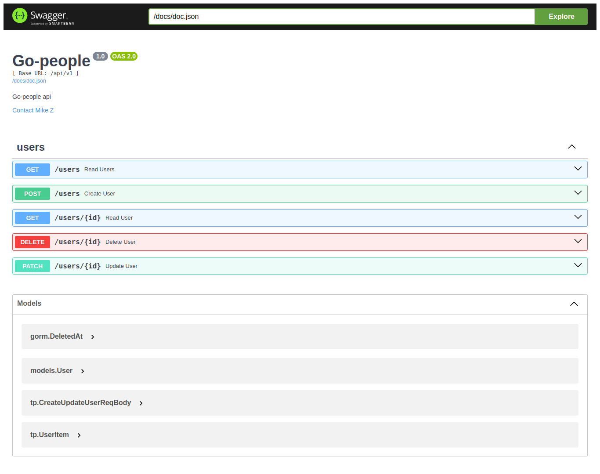
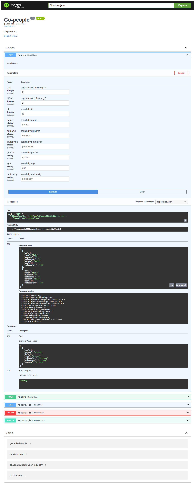
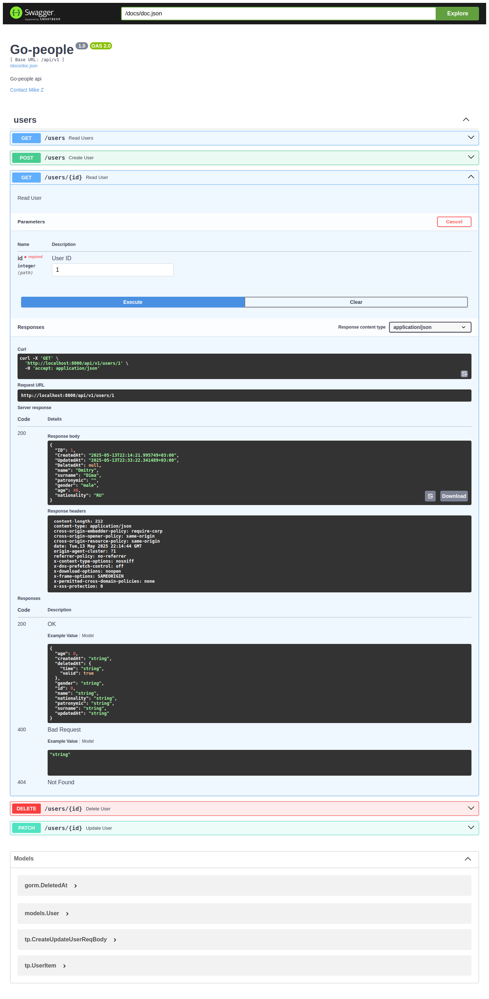
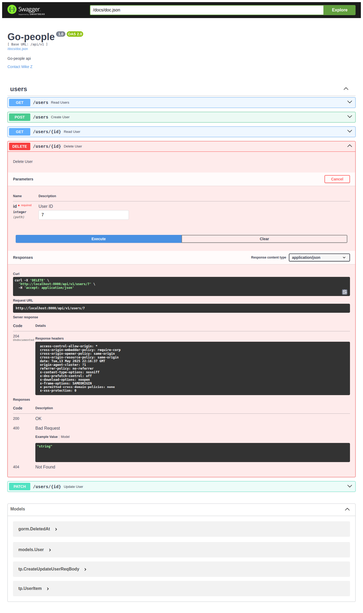
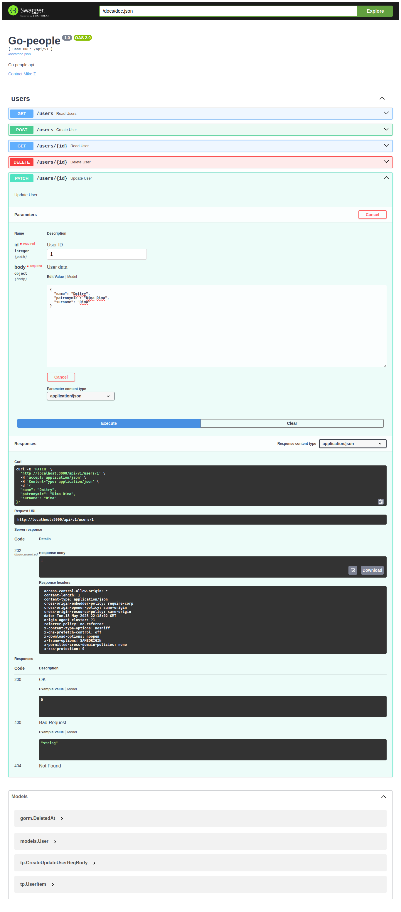

# People API

A Junior Golang Developer interview assignment

## Getting started

`docker compose -f "docker-compose.yml" up -d --build`

To run in a secure manner, you might want to create an environment variables file `.env`

## Requirements Specification

Document [srs.pdf](./files/srs.pdf)

## Output

1. Swagger [Swagger Documentation](./src/docs/swagger.json)
2. 
3. 
4. 
5. 
6. 
7. 

## Technologies used

1. Golang
2. Gorm
3. Fiber
4. Postgres
5. Git
6. Docker
7. Swagger
8. VS Code

## TODO

1. Add authentication and authorization
2. Add more tests
