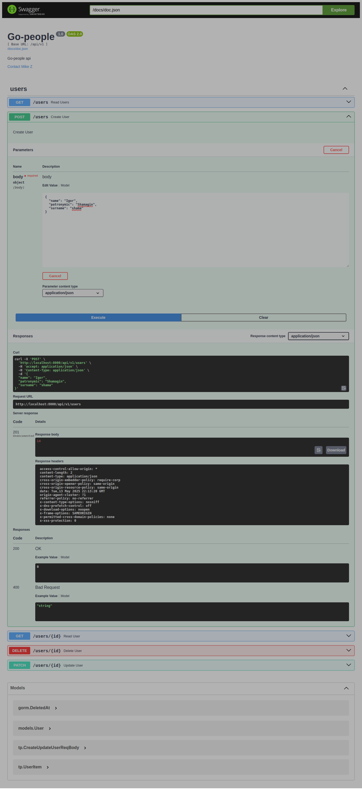

# People API

A Junior Golang Developer interview assignment

This project is a RESTful API service written in Golang using Go Fiber and GORM, designed to fetch, enrich, and store personal data. It retrieves a person's name via API, enriches it with probable age (Agify), gender (Genderize), and nationality (Nationalize), then stores the data in PostgreSQL.

Features:
✅ REST Endpoints for CRUD operations with filtering, pagination, and JSON support
✅ Data Enrichment via external APIs (Agify, Genderize, Nationalize)
✅ PostgreSQL Integration with automated migrations
✅ Swagger Documentation for API endpoints
✅ Environment Configuration using .env
✅ Logging (debug & info levels)
✅ Dockerized for easy deployment

Built with Go, Docker, Linux, Git, and PostgreSQL, this project demonstrates clean architecture and best practices for a junior Golang developer role.

🔹 Tech Stack: Go, Fiber, GORM, PostgreSQL, Docker, Swagger, Agify/Genderize/Nationalize APIs.

Deploy with docker-compose up and explore the API via Swagger UI! 🚀

## Getting started

`docker compose -f "docker-compose.yml" up -d --build`

To run in a secure manner, you might want to create an environment variables file `.env`

## Requirements Specification

Document [srs.pdf](./files/srs.pdf)

## Output

1. Swagger [Swagger Documentation](./src/docs/swagger.json)
2. 
3. 
4. 
5. 
6. 
7. 

## Technologies used

1. Golang
2. Gorm
3. Fiber
4. Postgres
5. Git
6. Docker
7. Swagger
8. VS Code

## TODO

1. Add authentication and authorization
2. Add more tests
